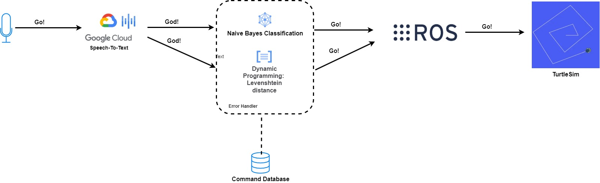

# Model-Selection-for-Speech-Robot-Control

## Descrizione del Progetto

Il progetto **Model-Selection-for-Speech-Robot-Control** è un programma ROS (Robot Operating System) che utilizza le **Google API Speech-to-Text** per implementare un riconoscitore vocale per il controllo di un **TurtleBot** simulato con **turtlesim**. Il sistema permette di controllare il robot tramite comandi vocali, con tre diverse metodologie di gestione degli errori:

1. **Senza gestione dell'errore**: Se il comando vocale non viene riconosciuto esattamente, il comando non viene eseguito.
2. **Gestione dell'errore con programmazione dinamica**: Utilizza un algoritmo di programmazione dinamica per calcolare la distanza tra due stringhe (ad esempio, la distanza di Levenshtein) e correggere eventuali errori di riconoscimento.
3. **Gestione dell'errore con modello Naive Bayes**: Un modello di machine learning (Naive Bayes) è stato addestrato su un mini dataset per correggere gli errori di riconoscimento. Attualmente, il modello ha una sensibilità del 54%, ma non è ancora integrato con ROS e non è accessibile per l'uso.
   
   

*Struttura del progetto.*

## Struttura del Progetto

Il progetto è organizzato come segue:

- **datasets**: Contiene i dataset utilizzati per addestrare e testare i modelli.
- **recognizer_lev_dist**: Implementazione della gestione degli errori con programmazione dinamica (distanza di Levenshtein).
- **recognizer_naive_bayes**: Implementazione del modello Naive Bayes per la gestione degli errori (non ancora integrato con ROS).
- **voice_control_turtlesim**: Script per il controllo vocale del TurtleBot in simulazione.

## 

## Utilizzo

1. Avvia il riconoscitore vocale.

2. Pronuncia uno dei comandi supportati (es. "avanti", "indietro", "destra", "sinistra").

3. Il sistema elaborerà il comando e lo invierà al TurtleBot.

## Metodologie di Gestione degli Errori

### 1. Senza Gestione dell'Errore

Se il comando non viene riconosciuto esattamente, il sistema non eseguirà alcuna azione.

### 2. Programmazione Dinamica

L'algoritmo calcola la distanza tra la parola riconosciuta e i comandi validi, correggendo eventuali errori.

### 3. Modello Naive Bayes

Il modello è stato addestrato per correggere gli errori di riconoscimento, ma non è ancora integrato con ROS.

## Autore

- **Georgi Dimitrov**
